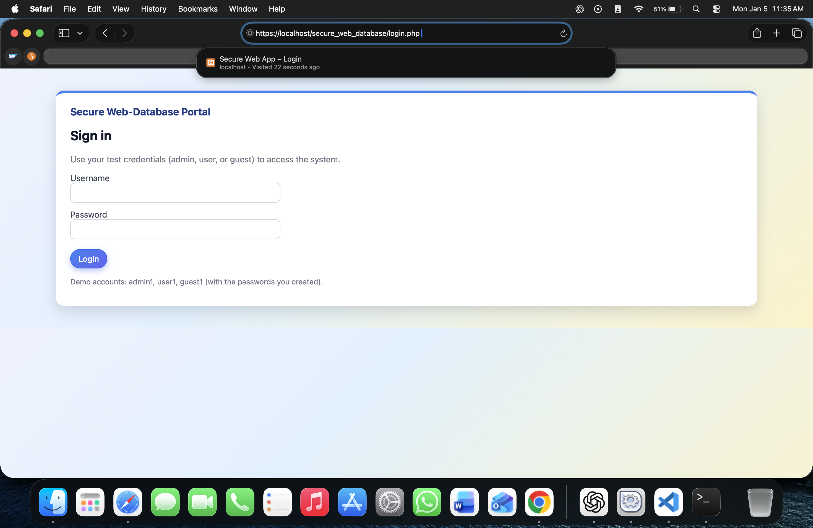
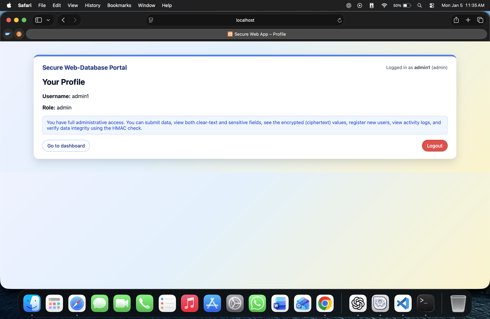
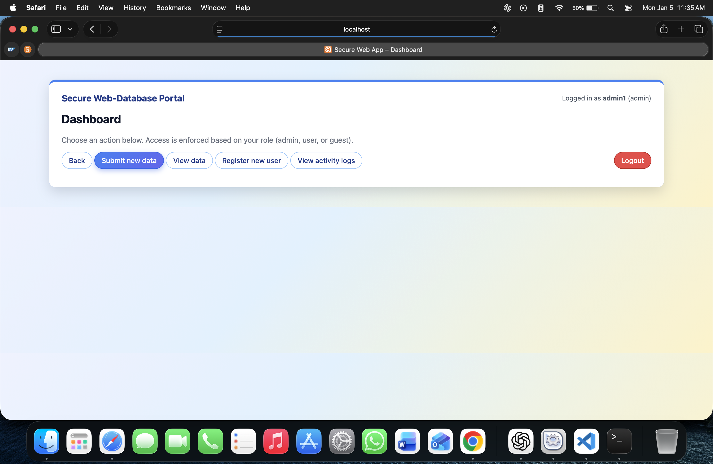
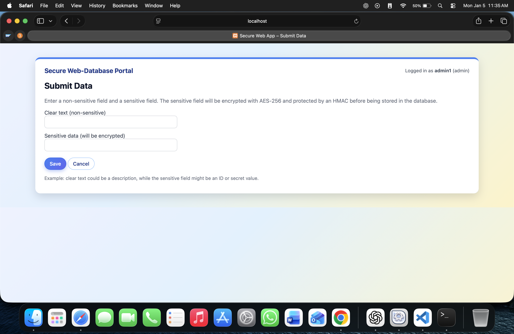
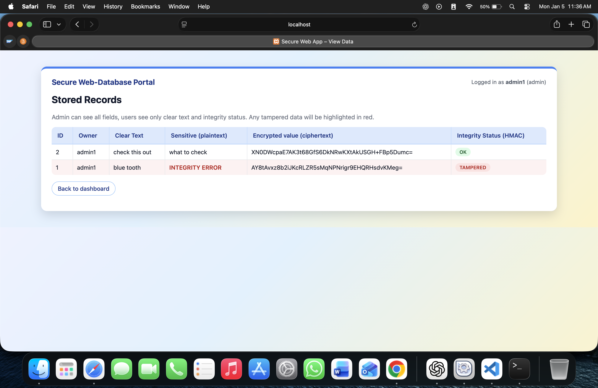
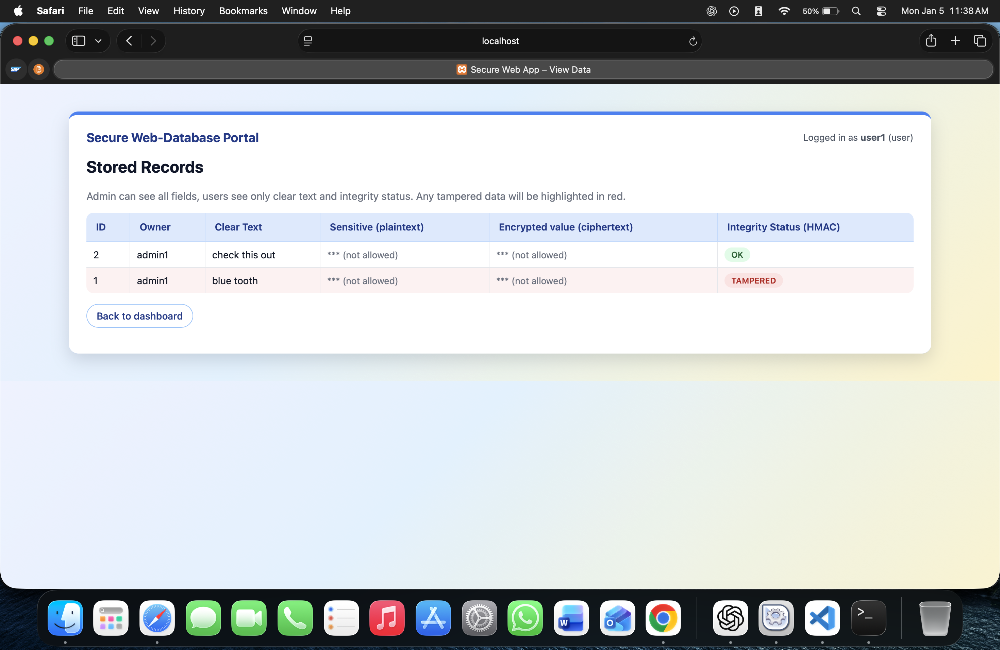
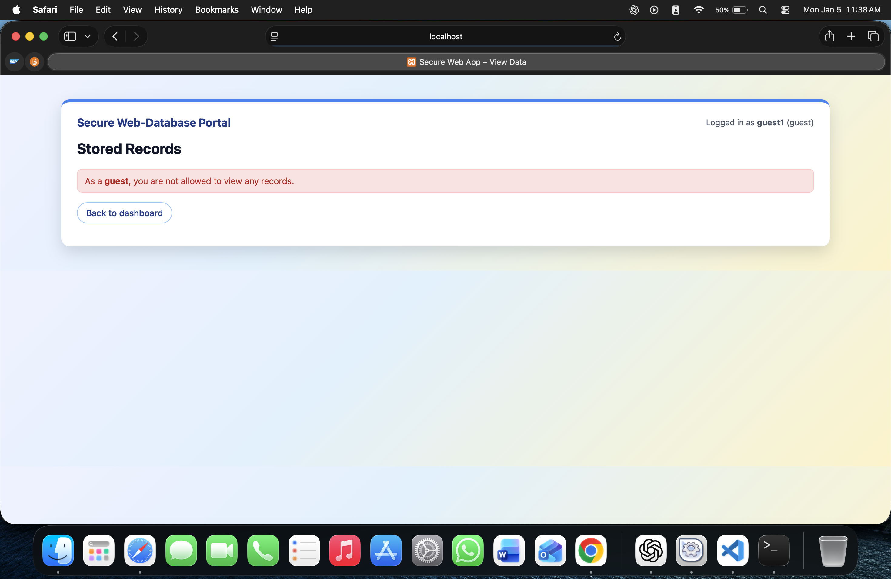

# Secure Web Database

A secure PHP web application demonstrating encryption, integrity protection, role-based access control (RBAC), HTTPS, and activity logging.

---

## Application Screenshots

### Login (HTTPS Enabled)


### Profile Page - Admin


### Admin Dashboard


### Submit Data


### View Data (Admin – Integrity OK and Tampered Detected)


### View Data (User Role)


### View Data (Guest Role)


### Activity Log (Security Auditing)


## Features
- AES-256-CBC encryption for sensitive data at rest
- HMAC-SHA256 integrity verification (detects tampering)
- Role-Based Access Control: Admin / User / Guest
- HTTPS enabled via Apache SSL configuration (XAMPP)
- Activity monitoring (login, logout, data submission)
- Secure password hashing using `password_hash()`

## Security Overview
- **Encryption:** Sensitive data is encrypted server-side using AES-256-CBC before storing in MySQL.
- **Integrity:** HMAC-SHA256 is computed over the clear-text field and encrypted sensitive data; any changes are flagged as **TAMPERED**.
- **RBAC:** Access is restricted based on role. Admin has full access; User has limited access; Guest cannot view/submit records.

## Tech Stack
- PHP
- MySQL
- Apache (XAMPP)
- OpenSSL
- HTML/CSS

## How to Run Locally
1. Install XAMPP and start **Apache** and **MySQL**
2. Clone:
   ```bash
   git clone https://github.com/PaulRo230/Secure-Web-Database.git
